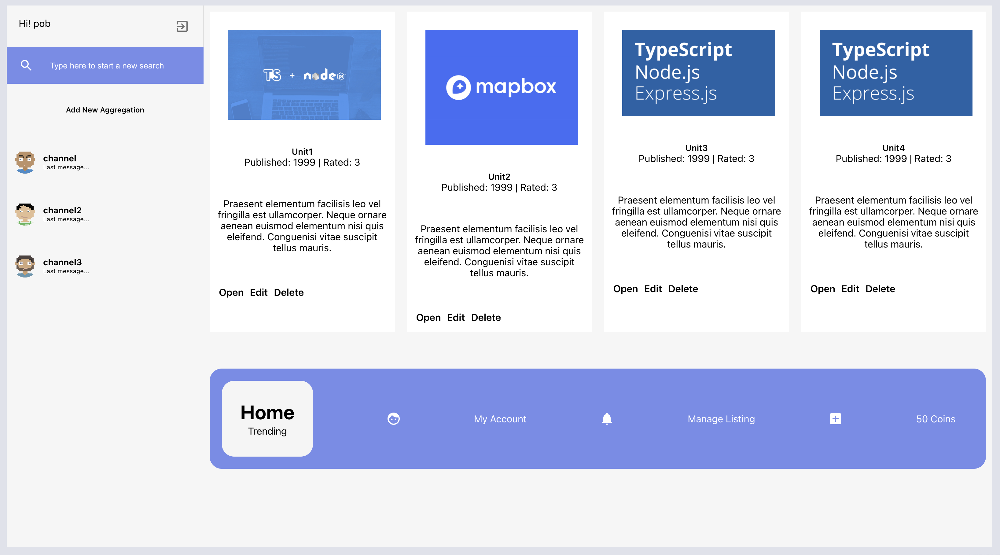

### Preview



### Overview

Boilerplate application for a Flask JWT Backend and a React/Redux Front-End with Material UI.

- Python 2.7+ or 3.x
- Pytest
- Flask
- React
- Redux
- React-Router-Redux

### Create Database

```sh
$ python3 manage.py
```

### Install Front-End Requirements

```sh
$ cd static
$ npm install
```

### Run Back-End

```sh
$ python3 manage.py
```

### Run Front-End

```sh
$ cd static
$ npm start
```

### Build Front-End

```sh
$ npm run build:production
```

### New to Python?

If you are approaching this demo as primarily a frontend dev with limited or no python experience, you may need to install dependencies!

You can check to see if you Python installed by doing:

```
$ python --version
$ pip --version
```

If pip is not installed, you can follow this simple article to [get both homebrew and python](https://howchoo.com/g/mze4ntbknjk/install-pip-on-mac-os-x)

After you install python, you can optionally also install python 3 with Anaconda (https://www.anaconda.com/)

```
$ brew install python3
```

Now you can check again to see if both python and pip are installed. Once pip is installed, you can download the required flask modules:

```
$ sudo pip install flask flask_script flask_migrate flask_bcrypt Flask-SQLAlchemy
```

Now, you can decide on which database you wish to use.

4. Run Back-End

```
$ python3 manage.py
```

If all goes well, you should see `* Running on http://127.0.0.1:5000/ (Press CTRL+C to quit)` followed by a few more lines in the terminal.

5. open a new tab to the same directory and run the front end

```
$ cd static
$ npm install
$ npm start
```

6. open your browser and got to http://localhost:3000/register and setup your first account. Enjoy! By this point, you should be able to create an account and login without errors.
